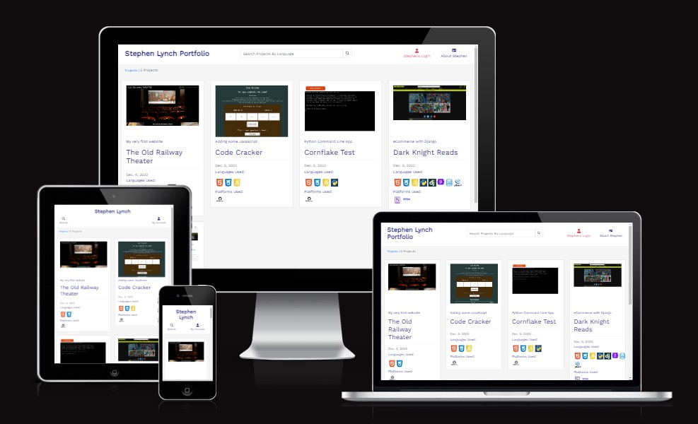
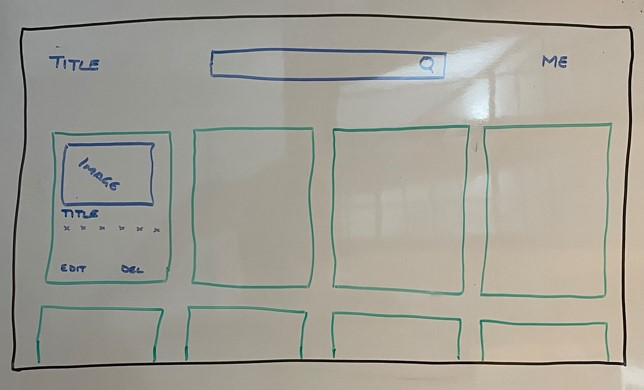
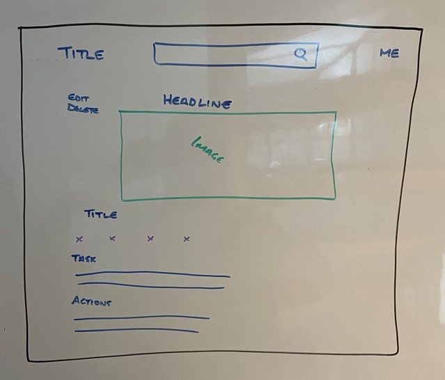
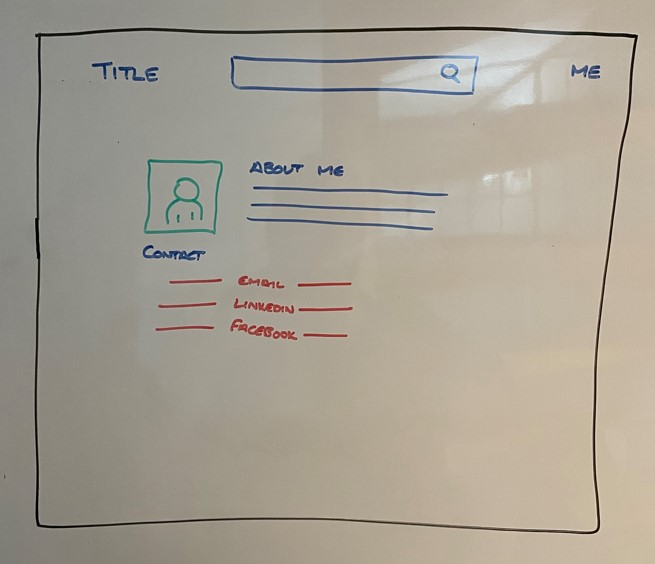
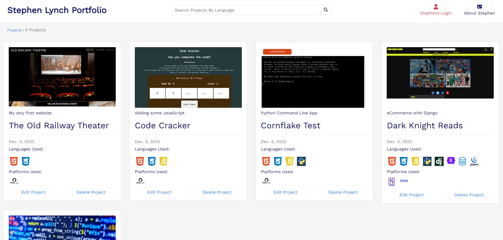
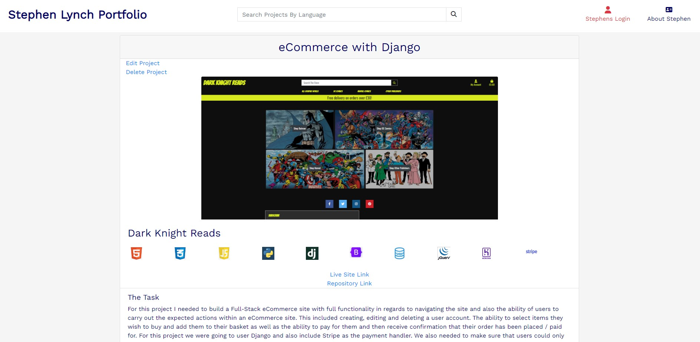
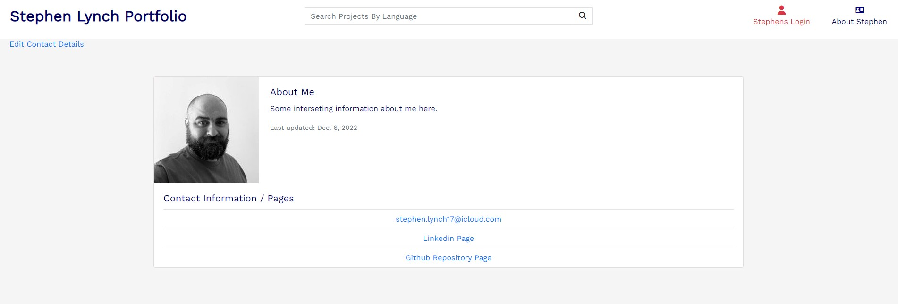
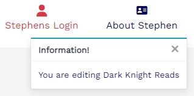
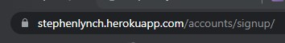
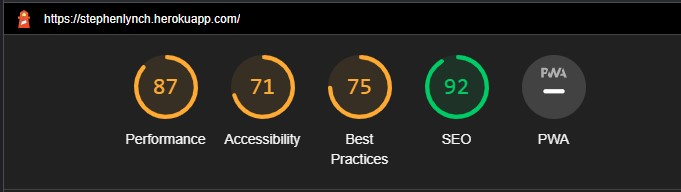

# Stephen Lynch Portfolio

Stephen Lynch Portfolio is a site designed to show of the projects I have worked on.

It is designed to have a card for each project with brief details about the project on it. Then when the user clicks the title they are taken to a project detail page that gives more information about the project, what I did, problems faced etc.

It is designed so that as I work on more projects I can add them to this site and edit them as the project evolves.

If needed there is also the ability to delete projects from the site.

There is also an 'About Me' page that gives a bit of information about me and some links to social media site and my email address.

### [View the live application on Heroku](https://stephenlynch.herokuapp.com/)

## Table of contents

- [UX](#UX)
    - [Business goals](#Business-goals)
    - [User goals](#User-goals)
    - [Layout Design](#Layout-design)
    - [Website pallette](#Website-pallette)
- [Features](#Features)
- [Technology](#Technology)
    - [Security](#Security)
- [Testing](#Testing)
    - [Funcionality testing](#Functionality-testing)
    - [Compatability testing](#Compatability-testing)
    - [Code validation](#Code-validation)
    - [Issues found during testing](#Issues-found-during-testing)
    - [Performance testing](#Performance-testing)
- [Deployment](#Deployment)
- [Credits](#Credits)
- [Screenshots](#Screenshots)

## UX

### Business goals

The aim of the site is to give people (who are interested) the ability to see some of the projects I have worked on. Equally it is a platform for me to maintain that documents my work as a web developer so I can reminisce about later in life.

It is designed in a simpe 3 page format, with the landing page showing the projects in card format. Each card gives a snapshot of information about the project, including the langauages and platforms used.

There is a search bar on this page which allows users to filter the projects by langauage / platform.

The second page is the project detail page, which has the same information as the landing page, but gives additional information like the project task, my actions, problems I faced and knowledge I gained.

The third page is the 'about me' page. This has (the best I could find) image of me and a paragraph about me. It also has my email address and some links to my social media. This is setup that if I were to add another account, Facebook for example, when I edit the page, it would automatically be added to this page.

### User goals

User can view the projects and navigate throught the site easily. There is no setup for users to create accounts as this is not a desired function of the site. However I have an account that allows me to keep it up to date with CRUD functionality.

### Layout Design

The layout is a simple blog layout and borrows the basic design from the CodeStar project. However it has been written from scratch using bootstrap the get the desired layout.

- Home Page layout

I wanted the projects laid out in card format as this gives a clean layout and maintains an organised page even on small screen sizes.

- Project Detail Page

I also wanted the card format to be reflected here in the project detail page, almost as if the user has focused in on the project and has gained more detail by doing so.

- About Me Page

This also has the card format, but in a different configuration - the image is to the side.

### Website pallette

The pallette for this is a simple light background and dark blue text. I chose the light background because all of my projects so far have been dark, so I wanted something that would make them show up.

- Background color: #f5f5f5 Which is just off-white.
- Font color: #000066 Which is a dark blue, almost like blue ink.
- Font choice: Work Sans - tis a nice clean font.

## Features

The site has 3 main pages that users will navigate through. These pages are;

- Project list page

- Product detail page

- About me page

There is a login, logout page for me. I also have pages for adding / editing projects / contact details.

There is a 404 page for any errors in page navigation.

### Existing Features

- Search Bar

    - The search bar allows users to search for projects based on languages / platforms that they enter.

- The landing page

    - This has a card of each project within the database. The cards are equally setout to give the page a clean look with clear information about each project.

- Project detail page

    - This is an enlarged card with more indepth detail about the selected project on it.

    - This information includes the task, actions, problems and knowledge gained.

- About me / contact page

    - This has a little bit of information about me on it in the form of a paragraph.

    - It also has links to my social media accounts and GitHub Repo.

- Users feedback

    - Throughout the site there are toasts that pop-up and give the me feedback on the actions I am carrying out out on the site - hopefully to stop me deleting something I shouldn't.

## Technology

### Security

- The security aspects of the site are handled by the built in csrf token use for securing POST request.
- Aspects of the site that are reserved for superusers are protected by the RequireLogin decorator in the code, so that only superusers can access them.
- Images are securly stored on Cloudinary.

Users can still access the signup page in order to create an account, they can do this typing the below into the browser;

 

This however does not afford the user any additional powers over the site as the functionality is exclusivly for superusers.

### Python / Django

- The programming language and framework.
### HTML

- The structure language of the site.

### Bootstrap / CSS

- The styling language and framework.

### Font Awesome

- The library for the icons used within the site

### Cloudinary

- The image storage for the site.

### Allauth

- User authentication, verification and account management.

### Crispy Forms

- Used for form context, styling and rendering.

### Gunicorn

- Web server for Python.

## Testing

### Functionality testing

- The site was developed using the Chrome developer tools for the HTML and styling elements.

#### Model Testing

    class TestProjectModel(TestCase):
    """ Inherits TestCase for all functions below
    """

    def test_project_creation(self):
        """ Tests to see if a project can be created as expected """
        project = Project.objects.create(project_title="Some Project")
        self.assertEqual(project.project_title, "Some Project")

The above test checks to see if a project can be added and it's title returned. 

### Views Testing

    class TestViews(TestCase):
    """ Inherits TestCase for all functions below
    """
    def test_open_home_page_works(self):
        """ Test the corrrect template is used
        """
        response = self.client.get('/')
        self.assertEqual(response.status_code, 200)
        self.assertTemplateUsed(response, 'index.html')

This test checks to see if the index.html templates is used when the portfolio is called on the home page.
#### Forms Testing

    class TestProjectForm(TestCase):
    """ Inherits TestCase for all tests below """
    def test_contact_form_create_ok(self):
        """ Test to see if we can create a test contact form """
        form = ContactForm({'email':'me@world.com'})
        self.assertTrue(form.is_valid())

    class TestProjectForm(TestCase):
    """ Inherits TestCase for all tests below """
    def test_project_title_is_required(self):
        """ Tests to see if the project title is a required field """
        form = ProjectForm({'project_title': ''})
        self.assertFalse(form.is_valid())

These tests check to see if the required fields on the forms are flagged as errors if they are omitted.
### Compatability testing

- The site has been tested on multiple screen sizes and is responsive throughout.

### Code validation

- The HTML and CSS have been tested using jigsaw.w3.org with no errors showing.

- The Python was also tested online with no errors showing.

### Issues found during testing

- When testing the models, views and forms with TestView I had an issue in getting the tests to run. This was because I had already deployed the site to Heroku and so had the database pointed to Postgres and not SQLite3.

- Once the database was reset to SQLite the test ran ok.

- As well as the automated testing I have thourghly tested the navigation, functionality and link aspects of the site and all are working as expected.

### Performance testing

- Site has been evaluated by Lighthouse and the report is below.

- While the SEO / Performance scores are high(ish), I would have liked to improve the other scores.

## Deployment

The site is deployed from Heroku.

1. Click deploy from app home page

2. Click GitHub link in deployment method and link the repository

3. Click deploy branch button

4. Click open app button

As part of the deployment process the static and media files were located onto Cloudinary platform. This was done by linking the app to my Cloudinary account.

# Future developments

- The main task now is to keep on building projects to a level that they show my development as a developer. Then they can be added to this site as an 'interactive CV'.

# Credits

- The site is influenced by the CodeStar project.

- StackOverflow proved a valuable resource for solving some of the bugs

- All of the images are images from my other projects, the owners can be found in the respecive ReadMe files.

- The other students on Slack helped me with the testing issues, clearly some had faced the same issue, such as the backport issues.

## Screenshots

### Landing Page

### Project Detail Page

### About Me Page
